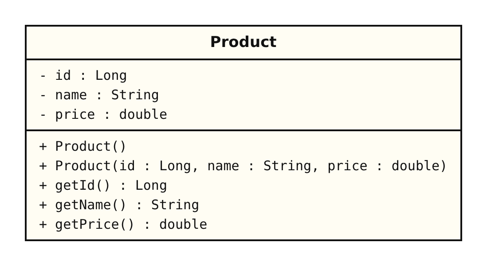
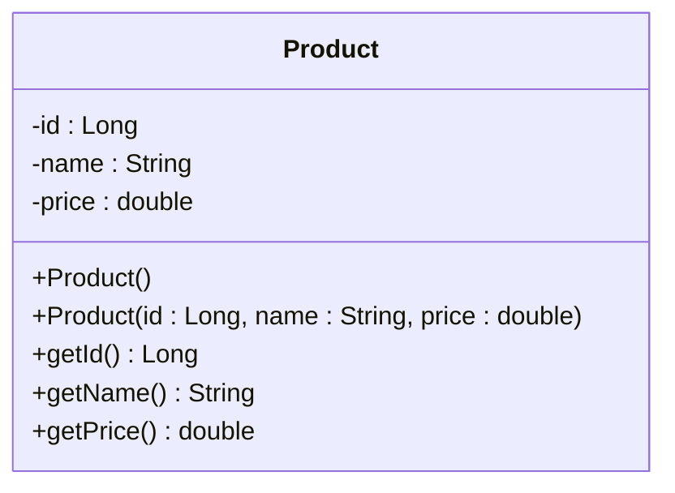

# Product — UML Class Diagram

```mermaid
classDiagram
    class Product {
        -id : Long
        -name : String
        -price : double
        +Product()
        +Product(id : Long, name : String, price : double)
        +getId() Long
        +getName() String
        +getPrice() double
    }
```

Notation: `-` = private, `+` = public. Attributes are written `name : Type`; constructors have no return type.
